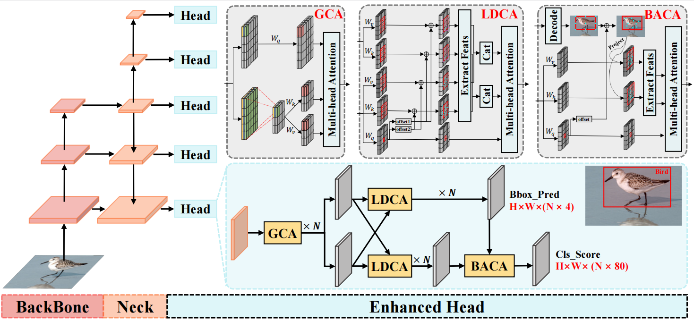

# Enhanced Head: Exploring Strong Detection Heads with Vision Transformer
This repository presents the official PyTorch implementation of **Enhanced Head**.

In this paper, we propose the Enhanced Head, which simultaneously incorporates Contextual Information Utilization Capability, Deformation Adaptation Capability, and Alignment Capability into various detectors. By replacing the original Decoupled Head with the proposed Enhanced Head, we achieve a reduction in computational complexity while delivering substantial performance improvements across multiple detectors.

Here is the overall architecture of the proposed Enhanced Head.
<p align="center">

</p>

## Installation
Please see [get_started.md](docs/en/get_started.md) for the basic usage of MMDetection.

## Training
```bash
bash tools/dist_train.sh configs/EnhancedHead/atss_enhanced.py 4
```

## Testing
```bash
python tools/test.py configs/EnhancedHead/atss_enhanced.py work_dirs/atss_enhanced/latest.pth --eval bbox
```
## Weight
Model | AP | Link1 | Link2 |
--- |:---:|:---:|:---:
atss_r50_enhanced | 42.3 | [BaiduNetDisk](https://pan.baidu.com/s/1edvsQRcvPBe6bP87qT86vA?pwd=pf34) | [GoogleDrive](https://drive.google.com/file/d/11KtjDAUjNZgZEUEdbpnVBNjmZtVTwr_O/view?usp=sharing)
retina_r50_enhanced | 39.8 | [BaiduNetDisk](https://pan.baidu.com/s/11vdxBSgOmlhEV5hM33I3_A?pwd=mbpa) | [GoogleDrive](https://drive.google.com/file/d/1pisRN-UqJo7bm27JkTB8kSB3htFAqDYS/view?usp=sharing)
fcos_r50_enhanced | 40.8 | [BaiduNetDisk](https://pan.baidu.com/s/1XytECKq8RAp1NiIIGKm7_Q?pwd=rw2u) | [GoogleDrive](https://drive.google.com/file/d/1y366qHAk7ga8mL6O1UMA1UiveV5Iwiwe/view?usp=sharing)
## Acknowledgement
This repository is built upon the [MMDetection](https://github.com/open-mmlab/mmdetection) library.

<!-- ## Citation
If you find this paper helpful for your project, we'd appreciate it if you could cite it.
```

``` -->